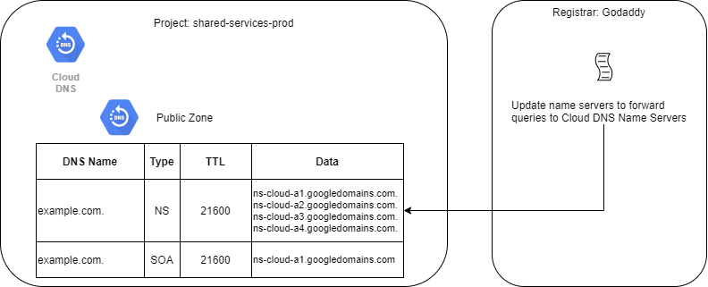
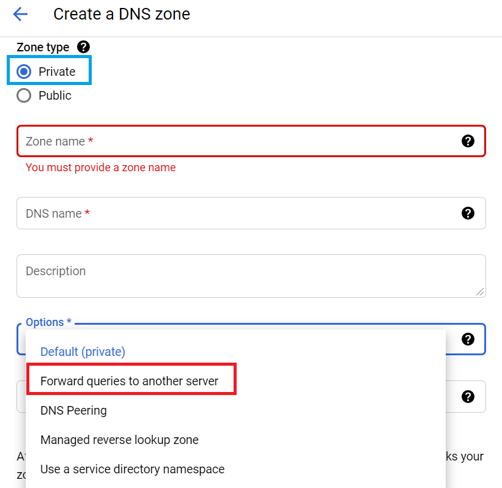

# DNS

## [Overview](https://cloud.google.com/dns/docs/overview)
1. [Managed Zones](#Managed-DNS-Zones)
1. [Migrating Public Zones](#Migrating-Public-Zones)
1. [Cloud DNS Name Resolution Order](#Cloud-DNS-Name-Resolution-Order)
1. [DNS Forwarding](#DNS-Forwarding)
1. [DNS Peering](#Cloud-DNS-Peering)
1. DNS Security
1. Migration of Public Zones
1. DNS Forwarding

## Managed DNS Zones
There are 3 types of zones for name resolution.
1. [Internal DNS](https://cloud.google.com/compute/docs/internal-dns)

    Provides host name resolutions inside of a VPC that is managed by Google from the metadata server 169.254.169.254. These host name records cannot be turned off.

    The format for a hostname is `[INSTANCE_NAME].[ZONE].c.[PROJECT_ID].internal`.

1. [Private Zone](https://cloud.google.com/dns/docs/best-practices#best_practices_for_private_zones)

    Private zones host DNS records that are visible only inside your organization. These records have a higher priority than Internal DNS records. Cloud DNS private zones support DNS services for a GCP project. VPCs in the same project can use the same name servers.

    * [Use Forwarding Zones to query on-premises servers](https://cloud.google.com/dns/docs/best-practices#use_forwarding_zones_to_query_on-premises_servers)
    * [Use DNS server policies to allow queries from on-premises](https://cloud.google.com/dns/docs/best-practices#use_dns_server_policies_to_allow_queries_from_on-premises)
    * [Open Google Cloud and on-premises firewalls to allow DNS Traffic](https://cloud.google.com/dns/docs/best-practices#open-google-cloud-and-on-premises-firewalls)

1. Public Zone

    A public zone is visiblie to the internet. Usually purchased and registered through a registrar like Godaddy.

    You must purchase a domain name from a registrar like Godaddy. Then update the registrar's name servers to point to the name servers in Google Cloud DNS. The registrar will then forward requests.

    

## [Migrating Public Zones](https://cloud.google.com/dns/docs/migrating)

Cloud DNS supports the migration of an existing DNS domain from another DNS provider to Cloud DNS. Here are the steps:

1. Create a managed zone in Cloud DNS that will contain your DNS records. When you create a zone, the new zone isn't used until you update your registration.
2. Export your DNS config from your provider. This can be either in `BIND` or in `YAML` format.
    > :star: Good testing material.
3. Import the record set
```gcloud
gcloud dns record-sets import -z=EXAMPLE_ZONE_NAME --zone-file-format path-to-file
```
4. Update registrar's name server records. Sign into the registrar provider and change the authoritative name servers to point to the name servers.
5. Wait for the changes and verify

## [Cloud DNS Name Resolution Order](https://cloud.google.com/dns/docs/vpc-name-res-order)

Each VPC provides name resolution for VMs. When VMs use their metadata server `169.254.169.254` as their name server, Google Cloud searches for DNS records in the following order:

>:star: Good to understand how DNS ordering works.
    
1. Outbound Server Policy. GCP forwards <b>ALL</b> DNS queries to those alternative servers. (Forward to on-premises DNS servers)
1. Searching records created in private zones.
1. Querying the forwarding targets for forwarding zones.
1. Querying the name resolution order of another VPC network by using peering zones.
1. Compute engine internal DNS
1. Queries publicily available zones

## DNS Forwarding

<b>Overview</b>


Cloud DNS Forwarding provides the ability to connect the Cloud DNS and on-premises environments for unified naming for workloads and resources. Use DNS Forwarding for inbound traffic, outbound traffic or both to support this type of architecture.

GCP Cloud DNS offers two different ways to foward DNS queries to on-premises DNS servers:
*  [Forwarding for Private Zone](###DNS-Forwarding-for-Private-Zones)
* [DNS Server Policies](###DNS-Server-policies).

> :star: You cannot use DNS Forwarding between GCP resources. It does not matter if these projects are in the same organization or in different organizations. You must use DNS Peering.

### [DNS Forwarding for Private Zones](https://cloud.google.com/dns/docs/overview#dns-forwarding-zones)

Cloud DNS forwarding zones let you configure target name servers for <u>specific private zones</u>. Using a forwarding zone is one way to implement outbound DNS forwarding from your VPC network.

A Cloud DNS forwarding zone is a special type of Cloud DNS private zone. This setting overrides normal DNS resolution of the specified zone. Instead of creating records within the zone, you specify a set of forwarding targets. Each forwarding target is an IP address of a DNS server, located in your VPC network, or in an on-premises network connected to your VPC network by Cloud VPN or Cloud Interconnect.

### Creating a forwarding zone

[Setting up a DNS Forwarder](https://cloud.google.com/dns/docs/zones#creating-forwarding-zones) is done at the early stages when creating a new private DNS zone.




>:star:This method has the highest priority when it comes to DNS resolution order.

2 Methods here: https://cloud.google.com/dns/docs/overview#dns-forwarding-methods

### [DNS Server Policies](https://cloud.google.com/dns/docs/overview#dns-server-policy)

DNS server policy can be configured for <u>each VPC network</u>.  The policy can specify inbound DNS forwarding, outbound DNS forwarding, or both.
* [Inboud Server Policy](https://cloud.google.com/dns/docs/overview#dns-server-policy-in)

  Inbound server policy allows for on-premises DNS to forward queries to Cloud DNS. After an Inbound Server Policy is created, Cloud DNS creates a set of [inbound forwarder IP addresses]((https://cloud.google.com/dns/docs/policies#list-in-entrypoints)) in each VPC where the policies are applied. These are the IPs the on-premises DNS servers will use to forward DNS requests.

* [Outbound Server Policy](https://cloud.google.com/dns/docs/overview#dns-server-policy-out)

  Using an Outbound Server Policy, you're specifying the  alternative name servers that are the <i>only</i> name servers that Google Cloud queriries for that specific VPC.
  > :start: <b>Important</b>: A DNS policy that enables outbound DNS forwarding disables resolution of Compute Engine internal DNS and Cloud DNS managed private zones

  

## Cloud DNS Peering

## Cloud CDN

## Cache Keys and Cache Invalidation

## Signed URLs